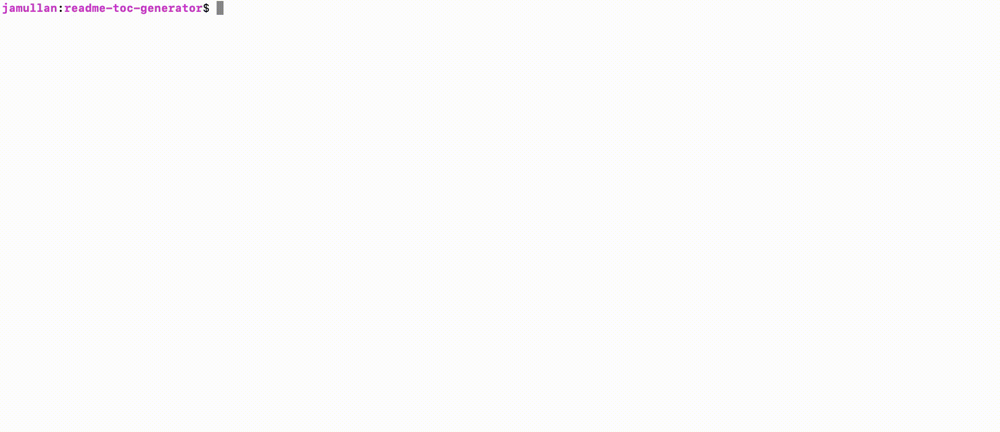
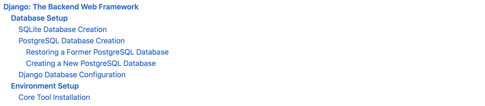

# Readme Table of Contents Generator
Generates a hyperlinked table of contents for .md files that use Github's flavor of the [CommonMark](<https://commonmark.org>) specification of Markdown.<br /><br />
**Last updated (this file):** 9/8/2020<br />
**Author:** John Mullan<br />

## Demo



## How to Run
```
# Clone this repository
$ git clone https://github.com/jamullan/readme-toc-generator.git

# Place your .md file into your clone of this repository

# Run the program and supply your .md file's name as an argument
$ python3 markdown_toc_generator <your_file.md>

# Copy the text from stdout and paste it in your .md file to serve as a hyperlinked table of contents
```

[**Django: The Backend Web Framework**](<#**Django-The-Backend-Web-Framework**>)<br />
&emsp;[**Database Setup**](<#**Database-Setup**>)<br />
&emsp;&emsp;[SQLite Database Creation](<#SQLite-Database-Creation>)<br />
&emsp;&emsp;[PostgreSQL Database Creation](<#PostgreSQL-Database-Creation>)<br />
&emsp;&emsp;&emsp;[Restoring a Former PostgreSQL Database](<#Restoring-a-Former-PostgreSQL-Database>)<br />
&emsp;&emsp;&emsp;[Creating a New PostgreSQL Database](<#Creating-a-New-PostgreSQL-Database>)<br />
&emsp;&emsp;[Django Database Configuration](<#Django-Database-Configuration>)<br />
&emsp;[**Environment Setup**](<#**Environment-Setup**>)<br />
&emsp;&emsp;[Core Tool Installation](<#Core-Tool-Installation>)<br />
